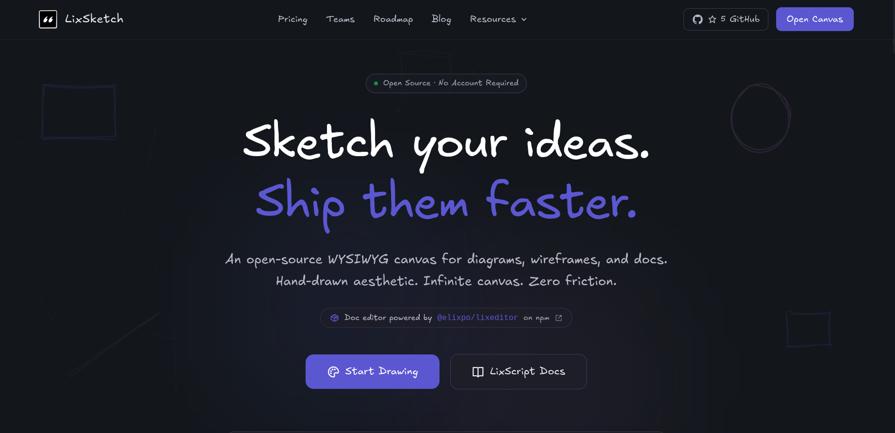

<!--
  ELIXPO README - follows the standard template (see STANDARDS.md §4 in the
  elixpo/elixpo canonical repo). Keep the section order. The product story,
  screenshots, and run docs are folded under "About" and the product sections.
-->

<p align="center">
  
</p>

<h1 align="center">LixSketch</h1>

<p align="center">
  <strong>An infinite-canvas, hand-drawn style whiteboard with a Notion-like docs editor.</strong><br/>
  Part of the open, ethical, and accessible Elixpo ecosystem - built by a global community of 45+ contributors.
</p>

<p align="center">
  <a href="https://sketch.elixpo.com">sketch.elixpo.com</a> ·
  <a href="https://elixpo.com">Elixpo</a> ·
  <a href="https://github.com/orgs/elixpo/discussions">Discussions</a> ·
  <a href="https://github.com/elixpo/elixpo_chapter">Monorepo</a> ·
  <a href="https://github.com/sponsors/Circuit-Overtime">Sponsor</a>
</p>

<p align="center">
  <a href="https://github.com/elixpo/sketch.elixpo/stargazers"></a>
  <a href="https://github.com/elixpo/sketch.elixpo/network/members"></a>
  <a href="https://github.com/elixpo/sketch.elixpo/issues"></a>
  <a href="./LICENSE"></a>
</p>

<p align="center">
  <a href="https://sketch.elixpo.com"></a>
  <a href="https://sketch.elixpo.com/docs"></a>
  <a href="https://www.npmjs.com/package/@elixpo/lixsketch"></a>
  <a href="https://marketplace.visualstudio.com/items?itemName=elixpo.lixsketch"></a>
</p>

---

## About

**LixSketch** is an open-source, freemium platform for collaborative canvas -
technical presentations, modelling, wireframes, and more. It pairs an
**infinite, hand-drawn style whiteboard** with a **Notion-like docs editor**, so
you can sketch ideas and write them up in the same place. The official hosted
deployment lives at **[sketch.elixpo.com](https://sketch.elixpo.com)**.

> It was one of my most favourite projects to build. It took 11 months to reach
> the stage where I could write this README and ship the MVP -
> [LixSketch](https://sketch.elixpo.com).

LixSketch is part of the **Elixpo** ecosystem - an open, ethical, and accessible
set of AI and developer tools, free to use and shaped by contributors from
around the world.


## The ecosystem

| Tool | What it does | Link |
| --- | --- | --- |
| 🎨 **Elixpo Art** | AI image generation _(under dev)_ | [art.elixpo.com](https://elixpo.com) |
| ✍️ **Elixpo Blogs** | A rich, modern writing and publishing space | [blogs.elixpo.com](https://blogs.elixpo.com) |
| 🖊️ **LixSketch** | A hand-drawn style whiteboard for ideas and diagrams | [sketch.elixpo.com](https://sketch.elixpo.com) |
| 💬 **Elixpo Chat** | A fluid, real-time AI chat experience _(under dev)_ | [chat.elixpo.com](https://chat.elixpo.com) |
| 🔎 **Elixpo Search** | Fast, AI-assisted search | [search.elixpo.com](https://search.elixpo.com) |
| 👤 **Elixpo Accounts** | One identity (SSO) across the ecosystem | [accounts.elixpo.com](https://accounts.elixpo.com) |
| 🔗 **lixrl** | Our flagship URL shortener | [lixrl.com](https://lixrl.com) |
| 🪪 **Portfolios** | Personal pages to showcase your work | [me.elixpo.com](https://me.elixpo.com) |
| 🐼 **Oreo** | The mascot's home | [oreo.elixpo.com](https://oreo.elixpo.com) |

Developers can drop our editors into their own projects with the
**`@elixpo/lixsketch`** and **`@elixpo/lixeditor`** packages, on npm and as VS
Code extensions.

## Why LixSketch?

LixSketch offers technical / professional proficiency in quick canvases used for
any technical interview, presentation, workshop, or classroom in a collaborative
fashion — sharable with anyone at any time in a matter of a click.


## What Makes LixSketch Stand Out

| | Feature |
|---|---|
| 🔓 | **No login required** — start drawing instantly as a guest |
| 🎁 | **Generous freemium model** — powerful tools at zero cost |
| 📜 | **LixScript** — our own [diagram scripting language](https://sketch.elixpo.com/docs) |
| 🧩 | **All-in-one workspace** — combines Excalidraw + TLDraw + Eraser.io |
| 🛡️ | **E2E encrypted sharing** — your data stays yours |
| 📂 | **Open Source** — MIT licensed, built in public |
| ⚡ | **Fast & free** — generous guest mode, no paywall |


## Use LixSketch Everywhere

<div align="center">

| | Platform | Description |
|---|---|---|
| 🌐 | **[Web App](https://sketch.elixpo.com)** | Full collaborative canvas in the browser |
| 🖥️ | **[VS Code Extension](https://marketplace.visualstudio.com/items?itemName=elixpo.lixsketch)** | Draw diagrams right inside your editor — open any `.lixsketch` file |
| 📦 | **[NPM Package](https://www.npmjs.com/package/@elixpo/lixsketch)** | Embed the engine in your own app with `npm install @elixpo/lixsketch` |

</div>

### VS Code Extension

Draw diagrams, sketch ideas, and build visual documents — without leaving your
editor. Just create a `.lixsketch` file and start drawing.

```
ext install elixpo.lixsketch
```


### NPM Package

Build your own whiteboard, diagramming tool, or collaborative canvas with a few
lines of code.

```bash
npm install @elixpo/lixsketch
```

```javascript
import { createSketchEngine, TOOLS } from '@elixpo/lixsketch';

const engine = createSketchEngine(svgElement);
await engine.init();
engine.setActiveTool(TOOLS.RECTANGLE);
```

Full API docs and examples in the [engine README](./packages/lixsketch/README.md).

## Monorepo layout

This repository is a workspace monorepo. The website/app lives at the root, and
the publishable artifacts live under `packages/`:

| Package | What it is | Published as |
| --- | --- | --- |
| `packages/lixsketch` | The SVG whiteboard engine + React canvas component | npm **[`@elixpo/lixsketch`](https://www.npmjs.com/package/@elixpo/lixsketch)** |
| `packages/vscode` | The LixSketch custom editor for `.lixsketch` files | VS Code Marketplace **[`elixpo.lixsketch`](https://marketplace.visualstudio.com/items?itemName=elixpo.lixsketch)** |

## Tech Stack

<div align="center">


</div>

## Documentation

We have a dedicated section for our [LixSketch Docs](https://sketch.elixpo.com/docs)
with a rich definition on how we implemented our architecture and product in the
open source with security and transparency.


## Running this project locally

```bash
npm install
npm run dev
```

This runs the Next.js app and the Cloudflare Worker together. Then open
[http://localhost:3000](http://localhost:3000).

## Built by the community

Elixpo is made by people, in the open. **45+ contributors** have shaped these
tools, with a small core team steering the way:

- **Ayushman Bhattacharya** - Founder & Lead ([@Circuit-Overtime](https://github.com/Circuit-Overtime))
- **Vivek Yadav** - Lead Co-Dev ([@ez-vivek](https://github.com/ez-vivek))
- **Anwesha Chakraborty** - Core Maintainer ([@anwe-ch](https://github.com/anwe-ch))

Everyone is welcome. See **[CONTRIBUTING.md](CONTRIBUTING.md)** and our
**[Code of Conduct](CODE_OF_CONDUCT.md)**. Found a bug on the platform? Let us
know from the [Issues Tab](https://github.com/elixpo/sketch.elixpo/issues).


## Recognition & programs

Elixpo has taken part in and been supported by **GSSOC**, **Hacktoberfest**,
**Pollinations.AI**, **MS Startup Foundations**, and **OSCI**.

## Get involved

- 💬 **Join the conversation** in [GitHub Discussions](https://github.com/orgs/elixpo/discussions).
- 🚀 **Submit your project** to be featured across the ecosystem.
- 🛠️ **Contribute** - browse good first issues in the [monorepo](https://github.com/elixpo/elixpo_chapter).
- ❤️ **Support us** via [GitHub Sponsors](https://github.com/sponsors/Circuit-Overtime).

## Brand assets

Brand-ready marks and per-service icons are part of the Elixpo brand kit. The
brand source of truth (mascot, palette, rules) lives in the
[canonical elixpo repository](https://github.com/elixpo/elixpo), and a browsable
kit is at **[elixpo.com/assets](https://elixpo.com/assets)**.

## License

Elixpo uses one **licensing standard** across every repository:

- **Code** - [MIT](LICENSES/preferred/MIT) (with the [Oreo-trademarks exception](LICENSES/exceptions/Oreo-trademarks)).
- **Brand & visual assets** - [CC-BY-4.0](LICENSES/preferred/CC-BY-4.0) (with the same exception).

The Oreo mascot, the chest E-badge, and the "Elixpo" and "Oreo" names, domains,
and palette are reserved - this protects the brand and its royalties while
keeping the code and assets free. See [`LICENSE`](LICENSE) and the per-product
notice board, [`NOTICE`](LICENSES/NOTICE).

## Exclusive

> Per-repo "exclusive" artifacts (an npm package, a VS Code extension, a hosted
> SaaS, a paid tier) are declared here and in [`NOTICE`](LICENSES/NOTICE).

**This repository ships exclusive artifacts:**

- **npm package `@elixpo/lixsketch`** (published from `packages/lixsketch/`) -
  the published package name `@elixpo/lixsketch` on the npm registry is reserved
  to Elixpo; forks must publish under a different name. The MIT-licensed source
  may be reused. Developers can install it with `npm install @elixpo/lixsketch`.
- **VS Code Marketplace extension `elixpo.lixsketch`** (publisher `elixpo`,
  extension `lixsketch`, published from `packages/vscode/`) - the Marketplace
  listing `elixpo.lixsketch` and the `elixpo` publisher identity are reserved to
  Elixpo; the extension source is MIT, but the listing and publisher are not
  transferred. Developers can install it with `ext install elixpo.lixsketch`.
- **Hosted SaaS `sketch.elixpo.com`** - the official hosted LixSketch
  deployment; the brand, hosted deployment, and operational data are reserved;
  the source is MIT.

## Star History

<div align="center">

<a href="https://star-history.com/#elixpo/sketch.elixpo&Timeline">
  <picture>
    <source media="(prefers-color-scheme: dark)" srcset="https://api.star-history.com/svg?repos=elixpo/sketch.elixpo&type=Timeline&theme=dark" />
    <source media="(prefers-color-scheme: light)" srcset="https://api.star-history.com/svg?repos=elixpo/sketch.elixpo&type=Timeline" />
    
  </picture>
</a>

</div>

---

<div align="center">


### Made with ❤️ by [Elixpo](https://elixpo.com) | [GitHub](https://github.com/elixpo/sketch.elixpo)

</div>
